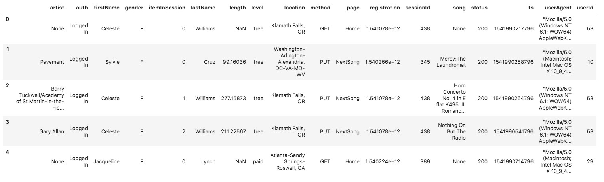
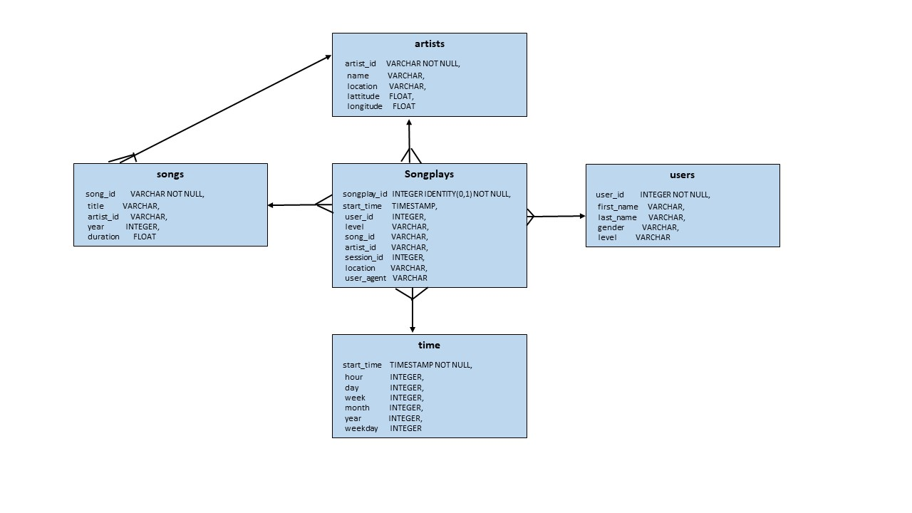

# Project: Data Lake

## Description
Sparkify is a music streaming startup which has grown user base and song database.  In anticipation of continuing growth of
the company, they are moving  the data warehouse to a data lake. The data resides on S3 in the format of JSON logs and includes the user 
activity on the app and metadata on the songs in the app.  

This project builds an ETL pipeline to extrat the data from S3, processes using Spark, loads the data back into S3
as a set of dimensional tables.  It deploys the Spark process on a AWS cluster.  Successful implementation of this
project will allow the analtyics team to continue finding insights on what songs the users are listening.

## Dataset
Two datasets reside in S3, as per following links for each.

    Song data: s3://udacity-dend/song_data
    Log data: s3://udacity-dend/log_data

Example of sample song data (metadata about a song and the artist of that song)

    {"num_songs": 1, "artist_id": "ARJIE2Y1187B994AB7", "artist_latitude": null, "artist_longitude": null, "artist_location": "", "artist_name": "Line Renaud", "song_id": "SOUPIRU12A6D4FA1E1",
     "title": "Der Kleine Dompfaff", "duration": 152.92036, "year": 0}
     
Example of sample log data (Sparkify music app activity logs generated by simulation)

## Database Design

### Star Schema
Using the song and event datasets, a star schema is created for performing queries on song play analysis. Star schema includes the following tables:

### Fact Tables    
    1. songplays - record in log data associated with song plays (records with page = NextSong)
    
### Dimension Tables
    2. users - users in the app
    3. songs - song in music database
    4. artists - artists in music database
    5. time - timestamps of records in songplays

songplays is a fact table and it has all the primary keys for other dimension tables - users, songs, artists, time.
Look at the following diagram to see the columns and relationships between the tables.

  
 
### ETL Pipeline (or ELT for Data Lake)

    (1) Extracts song and log json files data from S3 location,  creates temporary views (using Spark's createOrReplaceTemp() function) 
        for staging this data.
    (2) Spark SQL is used to load above five tables - songs, artists, users, time and songplays.  
    (3) All these tables are also written as parquet file at output data location.  
        
## Files

    (1) sparkify-etl.ipynb: For prototyping, developing, testing code step by step using local data and then S3.  etl.py was created from this file. 
    (2) etl.py: Reads song_data and load_data from S3, processes that data using Spark - trasforming to create five tables and 
                writes them back to partitioned parquet files in table directories on S3 (but writing to local machine for testing and avoid AWS charges).
    (3) dl-default.cfg: AWS credentials and Input, Output Paths. 

## TO RUN

    (1) Rename dl-default.cfg to dl.cfg AND Add [AWS] Credentials: key and secret that has permission to Read and Write to S3.
    (2) Run etl.py from the commandline: root@d73f90fd3ef3:/home/workspace# python etl.py 
   